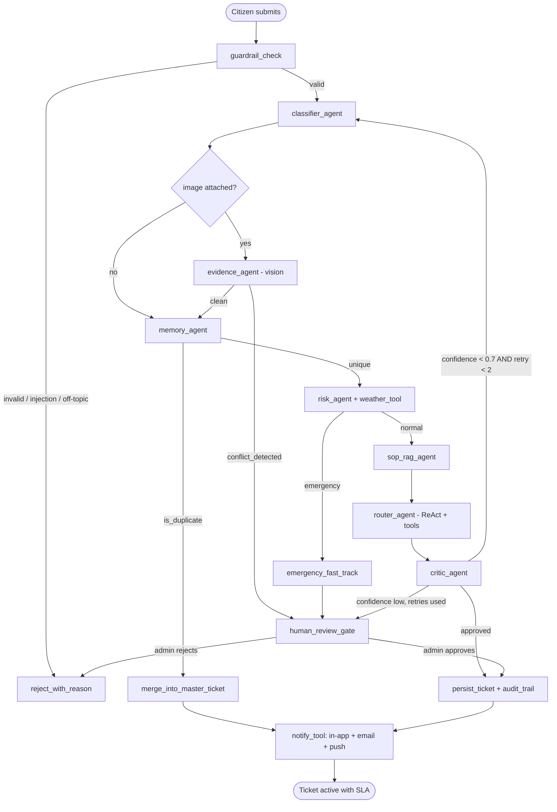

# CivicFlow AI — Architecture & Implementation Plan

Ye plan `PROJECT_REVIEW.md` ke gaps ko concrete design mein badalta hai.
Coding se pehle isko padh lein — README ka bara hissa yahin se copy ho jayega.

---

## 1. Problem statement (viva ke liye zaroori)

**Problem:** Pakistan ke municipal complaint systems mein citizen complaint likhta hai, phir wo
manually padhi jati hai, manually department assign hoti hai, aur koi SLA tracking nahi hoti.
Result: duplicate complaints, galat department, aur emergency issues normal queue mein phans jate hain.

**Target users:** (a) Citizen — issue report kare, status dekhe. (b) Authority officer — apne
department ki queue manage kare. (c) City admin — high-risk cases approve kare, analytics dekhe.

**Kyun agentic, simple chatbot ya rule-based script kyun nahi?**
Kyunki ek complaint par kai *dependent decisions* chahiye jo ek dosre ka natija badalti hain:
category → risk → duplicate? → SOP retrieval → department → SLA → human approval chahiye ya nahi.
Har complaint ka rasta different hota hai (emergency fast-track vs normal vs duplicate merge),
is liye **stateful graph with conditional edges** chahiye, linear chain kaafi nahi.
Ye exact justification README mein likhni hai — mam "why this architecture" poochti hain.

**Expected output:** ek structured, validated ticket (Pydantic) with department, risk score,
SLA deadline, SOP-based resolution plan, aur poora reasoning audit trail.

---

## 2. Final file structure

```
civicflow-ai/
├── app.py                      # Streamlit UI (mojood — sirf pipeline call badlegi)
├── .env.example                # keys ke naam, values khaali  ← NEW
├── .gitignore                  # .env, *.db, chroma_*/, __pycache__  ← NEW
├── README.md                   # setup + architecture + usage  ← NEW
├── requirements.txt            # commented deps ko uncomment karna hai
│
├── config/
│   ├── llm_config.py           # ChatGroq + Gemini fallback (DummyLLM delete)
│   └── settings.py             # constants: SLA hours, thresholds, model names
│
├── agents/
│   ├── schemas.py              # mojood Pydantic models (reuse)
│   ├── classifier_agent.py     # Agent 1
│   ├── evidence_agent.py       # Agent 2 (vision)
│   ├── memory_agent.py         # Agent 3 (Chroma dedupe + similar cases)
│   ├── risk_agent.py           # Agent 4
│   ├── sop_rag_agent.py        # Agent 5 (Agentic RAG)
│   ├── router_agent.py         # Agent 6 (ReAct + tools)
│   └── critic_agent.py         # Agent 7 (reflection)
│
├── graph/
│   ├── state.py                # CivicState TypedDict
│   └── civic_graph.py          # StateGraph + edges + checkpointer
│
├── tools/
│   ├── weather_tool.py         # OpenWeather (key already .env mein)
│   ├── ticket_tools.py         # search_similar / create / update
│   ├── sop_tool.py             # Chroma SOP lookup
│   └── notify_tool.py          # SendGrid email + Pushover push
│
├── guardrails.py               # input/output validation, injection filter
├── observability.py            # LangSmith setup + token/latency logging
├── database.py                 # mojood (thora extend)
├── Auth.py                     # mojood (security fix)
├── ingest_sops.py              # one-time: SOP docs → Chroma
│
├── data/sops/                  # 6-8 municipal SOP markdown files  ← NEW
├── tests/test_guardrails.py    # pytest  ← NEW
└── docs/screenshots/           # demo images  ← NEW
```

**Delete:** `orchestrator_pipeline.py` (replace), `routing_agents.py`, `operations_agents.py`,
`schemas_extended.py` (merge into schemas.py), `Auth screens snippet · PY`, `civic_ai.db`,
`chroma_db_store/` (ek Chroma path rakhein).

---

## 3. Agent roster — kaun kya karta hai

| # | Agent | Pattern | LLM? | Pydantic output | Kaam |
|---|---|---|---|---|---|
| 1 | Classifier | structured output | ✅ | `ProblemUnderstanding` | category, subcategory, severity, English summary (Urdu input bhi handle kare) |
| 2 | Evidence | multimodal | ✅ vision | `EvidenceIntelligence` | photo dekhe, text se cross-verify, `conflict_detected` |
| 3 | Memory | RAG retrieval | ❌ | `DuplicateCheck` + `MemoryRetrievalResult` | Chroma cosine similarity; >0.85 = duplicate, warna similar past cases |
| 4 | Risk | structured output | ✅ | `PriorityScoring` | risk 0-100, SLA hours, priority; weather tool se rain check (flooding risk) |
| 5 | SOP RAG | Agentic RAG | ✅ | `ResolutionPlan` | SOP docs retrieve kare, phir steps + cost generate kare |
| 6 | Router | **ReAct + tool calling** | ✅ | `DepartmentRouting` | tools use kar ke department decide kare, ticket create kare, notify kare |
| 7 | Critic | reflection | ✅ | `ReviewerAudit` | Router ka faisla re-check kare; confidence kam → wapis Agent 1 |

Sab schemas already `schemas.py` mein likhe hue hain — sirf
`llm.with_structured_output(Schema)` se wire karna hai. Ye aap ka time bachata hai.

---

## 4. Graph state (`graph/state.py`)

```python
class CivicState(TypedDict):
    # input
    raw_text: str
    image_path: str | None
    location: str
    latitude: float
    longitude: float
    citizen_email: str
    # agent outputs
    problem: ProblemUnderstanding | None
    evidence: EvidenceIntelligence | None
    duplicate: DuplicateCheck | None
    priority: PriorityScoring | None
    resolution: ResolutionPlan | None
    routing: DepartmentRouting | None
    critique: ReviewerAudit | None
    # control
    retry_count: int          # reflection loop guard (max 2)
    needs_human: bool
    guardrail_error: str | None
    trace: list[dict]         # har node ka reasoning → audit_logs table
    ticket_id: str | None
```

`trace` list hi aap ke **Agent Logs page** ko real bana degi — abhi wahan fake rows jate hain.

---

## 5. LangGraph workflow



**Conditional edges (ye 5 branches hi "agentic" proof hain):**
1. `guardrail_check` → valid / invalid
2. image hai ya nahi
3. duplicate → merge, warna aage
4. emergency → fast-track HITL, warna full pipeline
5. critic confidence → retry loop / HITL / approve

**Checkpointer:** `SqliteSaver` (`langgraph.checkpoint.sqlite`) — is ke baghair HITL interrupt
kaam nahi karega. Thread id = `ticket_id`, taake Admin approve kare to graph *wahin se* resume ho.

**HITL interrupt:** graph ko `interrupt_before=["persist_ticket"]` ke sath compile karein.
Admin ke approve button par `graph.invoke(None, config)` → resume. Ye aap ke mojood
"🛡️ HITL Safety" page ko decorative se real bana dega.

---

## 6. Tools (function calling — Router agent ke liye)

| Tool | Signature | Kyun |
|---|---|---|
| `get_weather` | `(lat, lon) -> dict` | barish ho rahi ho to flooding complaint ka risk +20 |
| `search_similar_tickets` | `(text, k=5) -> list` | Chroma se past cases |
| `lookup_department_sop` | `(category) -> str` | Chroma SOP collection |
| `get_department_load` | `(dept) -> int` | jis department par load kam ho, waha route (real DB count) |
| `create_ticket` | `(payload: TicketPayload) -> str` | DB write, ticket_id return |
| `send_notification` | `(email, msg, channel) -> bool` | in-app + SendGrid + Pushover |
| `web_search` | `(query) -> str` | optional: municipal helpline / utility outage info |

Router agent ko `llm.bind_tools([...])` se dein aur ReAct loop chalayein — yehi
"Tool/Function Calling" aur "ReAct" requirement dono cover karta hai.

---

## 7. RAG design (Agentic RAG)

**Corpus:** `data/sops/` mein 6–8 markdown files khud likhein (ye original content hai, copy nahi):
`wasa_water_sop.md`, `lesco_electrical_sop.md`, `lwmc_waste_sop.md`, `cw_roads_sop.md`,
`ssgc_gas_emergency_sop.md`, `sanitation_sop.md`, `escalation_matrix.md`, `sla_policy.md`.
Har file mein: scope, required equipment, step-by-step procedure, safety precautions, SLA, escalation.

**Pipeline:** `RecursiveCharacterTextSplitter(chunk_size=800, overlap=120)` →
embeddings (`sentence-transformers/all-MiniLM-L6-v2` — free, local) → Chroma
`municipal_sops` collection. `ingest_sops.py` ek dafa chalayein.

**Do collections (aap ke `database.py` mein already declared hain):**
- `municipal_sops` — procedures (RAG ke liye)
- `ticket_memory` — har naya ticket embed ho ke yahan **add** ho. Ye abhi missing hai —
  isi liye dedupe kabhi kaam nahi karta. `persist_ticket` node mein `.add()` call zaroori hai.

**Agentic kyun (simple RAG nahi):** retrieval ke baad Critic agent check karta hai ke retrieved
SOP relevant hai ya nahi; irrelevant ho to query rewrite kar ke dobara retrieve.

---

## 8. Guardrails (`guardrails.py`)

**Input side:**
- Length: 10–2000 chars; khaali/spam reject
- Prompt injection filter: "ignore previous instructions", "system:", "you are now" jaise patterns
- Off-topic classifier: complaint civic issue hai ya nahi (LLM ek boolean de)
- PII redaction: CNIC (`\d{5}-\d{7}-\d`) aur phone numbers mask karein log/trace se pehle
- Abuse/profanity flag → ticket bane magar `flagged_for_review=True`

**Output side:**
- Pydantic validation har agent output par (`ValidationError` → 1 retry with repair prompt)
- Range checks: `0 <= risk_score <= 100`, `sla_hours in {2,6,12,24,72}`
- Department whitelist: LLM sirf 7 approved agencies mein se chun sake, warna default + HITL flag
- Emergency override: agar emergency keywords hain magar LLM ne "Low" diya → force escalate
  (LLM ko blindly trust na karein — ye safety check mam ko impress karta hai)

**Error handling policy:** `except Exception: pass` ko **replace** karein
`logger.exception()` + user-facing message + degraded-mode flag se. Abhi 40+ silent excepts hain.

---

## 9. Observability

**LangSmith:** 4 env vars set karein, phir har graph run automatically trace ho jayega.
`@traceable` decorator custom functions par.

**Real telemetry (fake arrays ki jagah):** ek nayi table
`PipelineRun(id, ticket_id, node_name, latency_ms, prompt_tokens, completion_tokens, model, status, created_at)`.
Har node ke baad ek row insert. Phir Telemetry page in *asli* numbers se charts banaye:
avg latency per node, token cost per ticket, retry rate, HITL rate, guardrail rejection rate.
Isse aap ka sab se kamzor page (fake telemetry) sab se strong page ban jayega.

---

## 10. Environment variables (`.env.example`)

```
# LLM — Groq primary (free, fast). Gemini optional fallback.
GROQ_API_KEY=
GOOGLE_API_KEY=
LLM_MODEL=llama-3.3-70b-versatile
VISION_MODEL=llama-3.2-90b-vision-preview

# Observability
LANGCHAIN_TRACING_V2=true
LANGCHAIN_API_KEY=
LANGCHAIN_PROJECT=civicflow-ai
LANGCHAIN_ENDPOINT=https://api.smith.langchain.com

# Integrations
OPENWEATHER_API_KEY=
SENDGRID_API_KEY=
SENDGRID_FROM_EMAIL=
PUSHOVER_TOKEN=
PUSHOVER_USER=

# Storage
DATABASE_URL=sqlite:///./civicflow.db
CHROMA_DB_PATH=./chroma_store
```

**Provider recommendation** (aap ne "no preference" kaha tha): **Groq primary + Gemini fallback**.
Groq free hai, bohot fast hai, vision model bhi deta hai, aur mam ki list mein pehle number par hai.
Fallback wrapper thora extra code hai magar "production-oriented" ka strong signal deta hai.

**Ab hi karein:** `.gitignore` banayein jis mein `.env`, `*.db`, `chroma_store/`, `__pycache__/`.
Aap ki mojood `.env` mein keys khaali hain (main check kar chuka hoon) — is liye abhi tak
kuch leak nahi hua. Push se pehle ye step lazmi hai.

---

## 11. Phased task list

**Phase 1 — Requirement-critical (~1 din)**
1. `requirements.txt`: `langchain`, `langchain-groq`, `langchain-google-genai`, `langgraph`,
   `langgraph-checkpoint-sqlite`, `chromadb`, `sentence-transformers`, `langsmith`, `pydantic` uncomment
2. `config/llm_config.py`: `DummyLLM` delete → real `ChatGroq` + fallback + `@lru_cache`
3. `graph/state.py` + `graph/civic_graph.py`: 3 nodes se shuru (classify → risk → route), test karein
4. `guardrails.py` + `agents/` mein 4 agents structured output ke sath
5. `app.py` ka submit button naya graph call kare (`orchestrator_pipeline` retire)
6. Bug fix: citizen identity ko har jagah full email banayein
7. `.gitignore` + `.env.example` + `README.md`

**Phase 2 — Requirement complete (~1 din)**
8. `data/sops/` likhein + `ingest_sops.py` chalayein
9. `sop_rag_agent` + `memory_agent` (Chroma add + query dono)
10. `tools/` ke 6 tools + Router agent par `bind_tools`
11. LangSmith on + `PipelineRun` table + real Telemetry page

**Phase 3 — Unique advance layer (~1 din)**
12. `critic_agent` + reflection loop (retry guard 2)
13. `SqliteSaver` + `interrupt_before` → real HITL resume
14. Vision evidence verification
15. Geo hotspot prediction + Urdu intake normalization

**Phase 4 — Polish (~half din)**
16. Dead code + duplicate db/chroma delete
17. `pytest`: guardrails (5 tests), routing whitelist (3), dedupe threshold (2)
18. Screenshots + Mermaid diagram README mein
19. Git repo + Streamlit Cloud deploy

---

## 12. README.md ka outline (mam is ko dekhengi)

```
# CivicFlow AI — Agentic Municipal Complaint Intelligence
1. Problem & target users            (section 1 se copy)
2. Why an agentic architecture?      (section 1 ka justification — sab se important)
3. Architecture diagram              (section 5 ka Mermaid)
4. Agent roster table                (section 3)
5. Tech stack                        (mam ki table ke against mapping)
6. Setup: clone → venv → pip install → cp .env.example .env → keys → ingest_sops.py → streamlit run
7. Usage examples with 3 sample complaints + expected outputs
8. Screenshots (5-6)
9. Guardrails & error handling
10. Observability (LangSmith screenshot)
11. Known limitations & future work   ← ye honesty marks deti hai
```

---

## 13. Viva prep — mam ke likely sawal

1. **"Ye agent hai ya chain? Difference dikhao."** → Mermaid diagram ke 5 conditional edges +
   critic retry cycle dikhayein. Chain mein cycle nahi hoti.
2. **"Reflection loop infinite kyun nahi hota?"** → `retry_count` guard, max 2, phir HITL.
3. **"RAG kyun, LLM ko seedha kyun nahi poocha?"** → SOPs municipal-specific hain, LLM ki
   training mein nahi; hallucination ka risk; source traceability chahiye.
4. **"Agar Groq down ho jaye?"** → Gemini fallback, phir rule-based degraded mode + user ko
   saaf batana ke degraded mode hai (silently fake result nahi dena).
5. **"HITL kahan hai?"** → checkpointer + `interrupt_before` demo — graph ruka hua state dikhayein.
6. **"Prompt injection se kaise bachte ho?"** → guardrails input filter + department whitelist +
   emergency override (LLM output blindly trust nahi hota).
7. **"Ye telemetry numbers kahan se aate hain?"** → `PipelineRun` table + LangSmith trace.
   (Isi liye hardcoded arrays hatana zaroori hai.)

---

## 14. Do cheezein jo main phir bhi highlight karna chahta hoon

1. **Fake telemetry sab se bara risk hai.** "System Health 99.8%", "Avg Routing SLA 1.4s",
   latency arrays — ye code mein literal values hain. Agar mam ne poocha aur jawab "hardcoded hai"
   hua, to ye originality/integrity section par chala jayega. Phase 2 tak isko real karein,
   ya tab tak UI par saaf "Simulated demo data" label lagayein.

2. **`Auth.py` line 26 ka `plain_password == hashed_password`** — ye plaintext password ko valid
   maan leta hai. Ek line delete karni hai, magar security review mein turant pakra jata hai.
